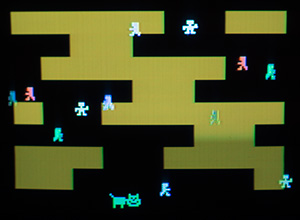

# rash
Rash by Frog //ROi 
256 bytes intro for Philips Videopac 
Released at Chaos Constructions'2016 

Platform: Philips Videopac home computer (PAL) 
It should work on Magnavox Odyssey 2 (NTSC) with some side effects

rash.bin - 2kb ROM cartridge image (only 256 bytes used)

Intro runs on real hardware and with o2em emulator

If you don't have Videopac, check out Youtube video:  
https://www.youtube.com/watch?v=2i8nf2Fi_h8

Thanks to Tnt23 for making composite output (much better image quality compared to RF) and Soren Gust (Videopac tutorials and tips)

Credits for this intro:

Code/graphics: Frog 

License: MIT
